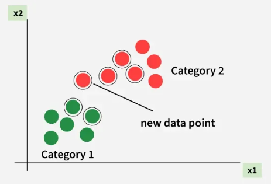

K-Vizinhos
================

## Classificação
O algoritmo é utilizado para fazer classificações baseadas em dados vizinhos do que quero classificar, onde **k** representa o número de vizinhos que devemos levar em consideração ao classificar um novo dado. Podemos exemplificar isso com um algoritmo de recomendação de filmes.
1. É feito um perfilamento para cada usuário, podendo ser uma classificação de 0 a 10 por gosto por gênero.
2. Inserimos os usuário em um gráfico.
3. Podemos calcular a "distância" entre cada usuário para tentar encontrar algo em comum entre eles (quanto menor distância, mais recomendável).
   
## Funcionamento
Pontos verdes e vermelhos pertencem à categorias distintas e adicionamos um novo dado sem categoria. O novo dado é analisado e constatado que há mais vizinhos da categoria vermelha, então esse novo dado é vermelho.

## Regressão
Em vez de classificar categorias, podemos utilizar esse algoritmo para prever valores numéricos com uma média aritmética sobre os valores analisados.

• Classificação = classificar em grupos.
• Regressão = adivinhar uma resposta (como um número).

Podemos utilizar agrupando características de dados para prever um número. Exemplo: Utilizamos 3 dados para determinar quantos pães serão usados em um dia, para isso criamos um conjunto de características.
- O clima em uma escala de 1 a 5 (1 = ruim, 5 = ótimo).
- Fim de semana ou feriado? (1 se for um fim de semana ou feriado;
  0, caso contrário).
- Há um jogo nesse dia? (1 caso tenha; 0, caso contrário).

Fica algo **como** A(5,1,0), B(3,0,1)...

## Machine Learning
É a técnica de "ensinar" o computador com dados para prever mudanças etc.

- **OCR** (Reconhecimento Óptico de Caracteres) é uma tecnologia que converte imagens de texto (documentos digitalizados, fotos, PDFs) em dados de texto pesquisáveis e editáveis. Ela utiliza IA e visão computacional para identificar letras e números
