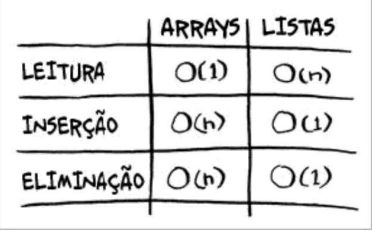

# Capítulo 2

## Arrays e listas encadeadas

**ARRAYS** funcionam fazendo com que o computador armazene uma quantidade específica de slots na memória, baseado no tipo (int, float etc.) da array e na quantidade de elementos definida. Os elementos ficam em endereços lado a lado dentro da memória.

Sua limitação é que a definição de tamanho pode limitar o programa.
Exemplo: Um professor criou uma array com 30 notas que são inseridas automáticamentes, mas em dado momento ele precisava de 40 notas. Então é necessário que essa array seja movida na memória para um local que tenha 40 slots em sequência livres.

**Listas encadeadas** funcionam armazenando dados de forma parecida com arrays, mas os elementos não precisam estar lado a lado na memória. Eles ficam separados, não necessariamente em endereços em sequência. Cada elemento de uma lista encadeada aponta para o endereço do próximo elemento, assim sucessivamente.
Em C, cada elemento possui um ponteiro para o próximo elemento.

### Tempo de execução para inserção e leitura



## Ordenação por seleção

A ordenação por seleção serve para elementos serem ordenados a partir de uma "Regra". Como quando queremos ordenar uma lista de artistas beseada em quantidade de ouvintes, do maior para o menor. 
Uma forma seria retirar elementos de uma lista não ordenada e passar para outra lista de forma ordenada. Supondo uma lista com 5 elementos, precisaríamos ler os elementos dela 5 vezes.

```
read 5 elements from array1 ... rm 1 element and add to array2
read 4 elements from array1 ... rm 1 element and add to array2
read 3 elements from array1 ... rm 1 element and add to array2
...

```
Sendo **n** o número de elementos da lista, para ler uma só vez demonstramos como ``O(n)``, para ler mais, ``O(n²)``.
