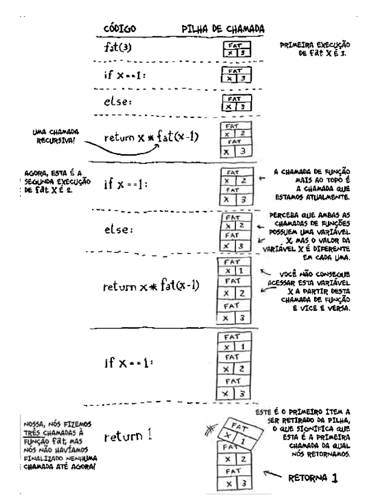

# Recursão

A recursão funciona chamando a função dentro da função, executando um código em forma de looping. A função recursiva precisa ter um **caso base** e **caso recursivo** para funcionar. 
Caso base: Determina quando código deve parar de rodar, feito uma condição com IF.
Caso recurivo: Determina o looping, a condição *diferente* do caso base.

Exemplo:

```python

def regressiva(i):
    print(i)
    if i <= 1: #caso base
        return
    else:
        regressiva(i-1) #caso recursivo
```
## Pilha de chamada 

Chamada de **call stack**, é um mecanismo do interpretador de uma linguagem que organiza o funcionamento do código quando são chamadas muitas funções "uma dentro da outra".

- Quando o script chama a função, ela é adicionada à pilha de chamadas, e então é iniciado o carregamento da função. O computador aloca uma caixa de memória para cada função chamada.
- Qualquer função chamada por essa função será adicionada à pilha de chamadas uma acima da outra.
- Quando a função termina a execução, o interpretador retira a função da pilha e continua a execução do programa de onde parou.


```python

def sauda2(nome):
    print("Como vai ", nome ,"?")
def tchau():
    print("ok, tchau!")


def sauda(nome): #adiciona esse elemento "sauda" como primeiro na pilha
    print(f"Olá, ", {nome} ,"!")
    sauda2(nome) #adiciona esse elemento "sauda2" sobre o elemeneto 01
    print("preparando para dizer tchau...") #chamada do elemento 2 finaliza e ele é removido da pilha
    tchau() #adiciona esse elemento "tchau" como segundo da pilha, executa e já remove-o.
    #finaliza pilha e, finalmente, remove o elemento 1 da pilha. 

```

## Pilha de chamada com recursão

Quando executamos uma função recursiva, o computador as empilha conforme chamada e desempilha conforme execução.

```python

def fat(x):
    if x == 1:
        return 1
    else:
        return x * fat(x-1)

```
supondo a função recursiva acima e chamando como fat(3), teríamos um mecanismo de leitura do programa assim:

