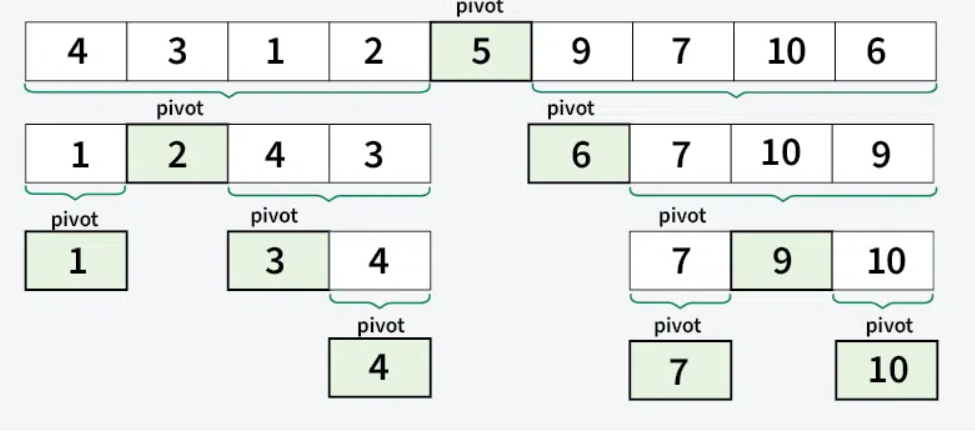

# Quicksort

Quicksort é um algoritmo de ordenação que utiliza a técnica de "dividir e conquistar". A técnica consiste em escolher um valor como pivô e particionar o conjunto de valores (podendo ser um array) em torno desse pivô, colocando-o na posição correta no array ordenado.

**Podemos dividir esse metódo em 4 etapas**

1. Escolha o pivô: Selecione um valor do array como pivô. A escolha pode variar, podendo ser escolhido com base de ser primeiro elemento, último elemento, aleatório ou mediana.
2. Particionar o array: Separamos os valores maiores que o pivô na direita e os menores na esquerda, criando duas arrays.
3. Recursão: Escolhemos um novo pivô em cada array nova, utilizando o mesmo metódo do passo 1. Particionamos as sub-arrays do mesmo jeito.
4. Caso Base: Criamos um caso base para a recursão parar. Nesse caso sendo quando alguma array possuindo apenas um elemento.

Quicksort funciona como **prova por indução**, sendo uma forma de provar que o algoritmo funciona. Criando um caso indutivo (recursivo) e um caso-base.
