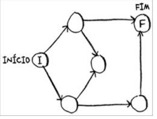

**6.1** Encontre o menor caminho do início ao fim.

**Resposta:** O início será a raiz/vértice inicial. Avançando 1 vez podemos prosseguir por cima ou por baixo. Em ambos os casos nos deparamos com um vértice que está ligado em ambos e nada mais. Ignoramos este e seguimos. Constatamos que por cima há apenas 1 elemento antes do vértice final. Por baixo há dois. Por cima é mais rápido.