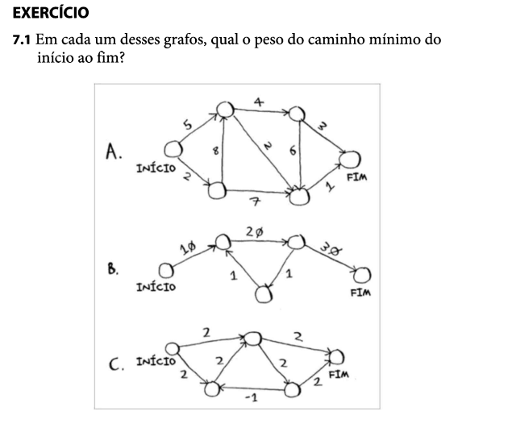

**7.1**

**Respostas:**
- A. 5 > 2 > 1 = 8
- B. 10 > 20 > 30 = 60
- C. 2 > 2 = 4 **Nesse exemplo acredito que não poderia ser aplicado porque há pesos negativos, mas esse caminho em específico não há esses pesos. Algoritmo de Dijkstra não funciona em grafos com pesos negativos.