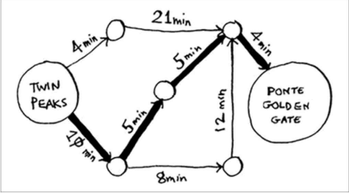

# Algoritmo de Dijkstra

Em grafos não ponderados e árvores vamos utilizar a pesquisa em largura para fazer a pesquisa entre os elementos e encontrar o caminho mínimo, que é onde há menos arestas para percorrer. O alogoritmo de Dijkstra funciona em casos de grafos ponderados, que são grafos que cada aresta está atribuída um custo, como um tempo. Então esse algoritmo efetua a pesquisa em grafos ou árvores (raramente em árvores, pois elas possuem um único caminho entre vértices) que possuem arestas ponderadas e determinam o caminho mais rápido.

1. Encontre o vértice mais barato. Este é o vértice em que você consegue chegar no menor tempo possível.
2. Atualize o custo dos vizinhos do vértice escolhido (vértices com pesos desconhecidos terão o peso definido como infinito).
3. Repita até que tenha feito isso para todos os vértices do grafo.
4. Calcule o caimho final.
   
